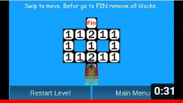
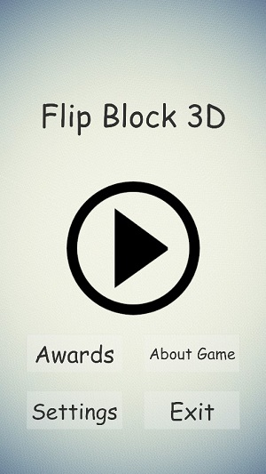
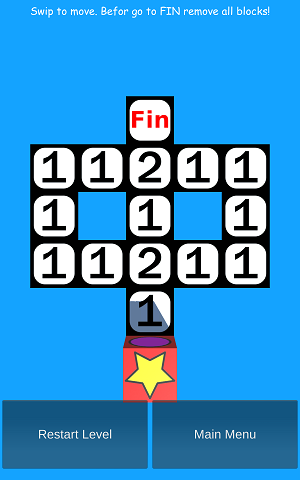
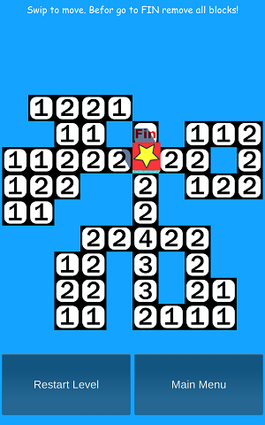

# FlipBlock3D - Game
Logic game where you should clear all tiles before reaching the finish of level. Level editor for this game you can find here: https://github.com/bertekg/FlipBlock3D_LevelEditor. This game is developed in Unity.

## Game trailer

Flip Block 3D - Promotion Trailer: https://www.youtube.com/watch?v=QojJZmaGduw&ab_channel=Bart%C5%82omiejGrywalski

## Screenshots

### 1. Main Menu

### 2. Level Basic 1

### 3. Level Basic 3

